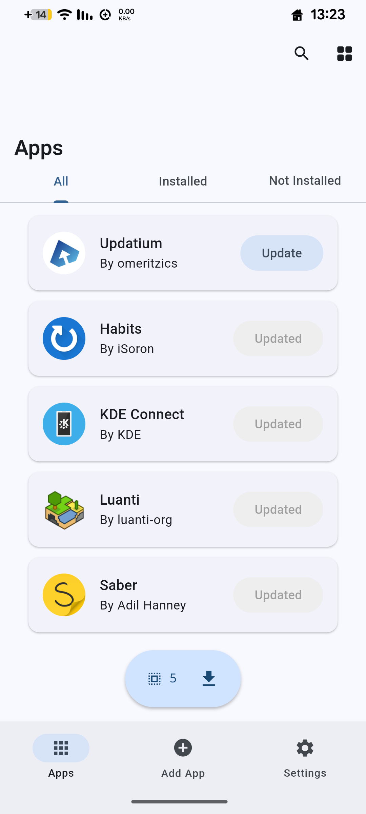
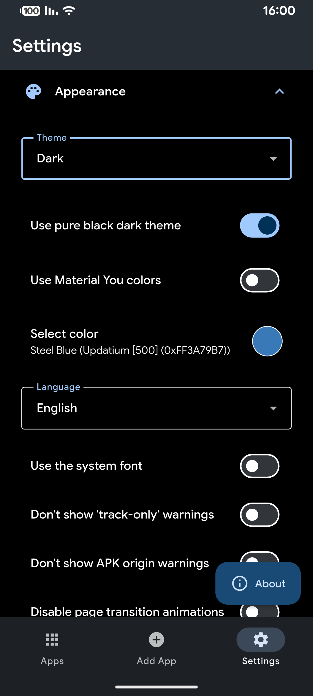
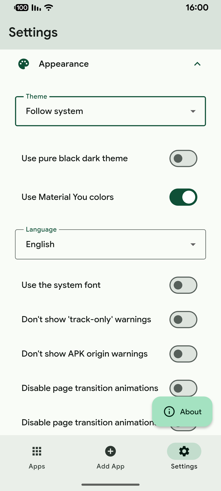
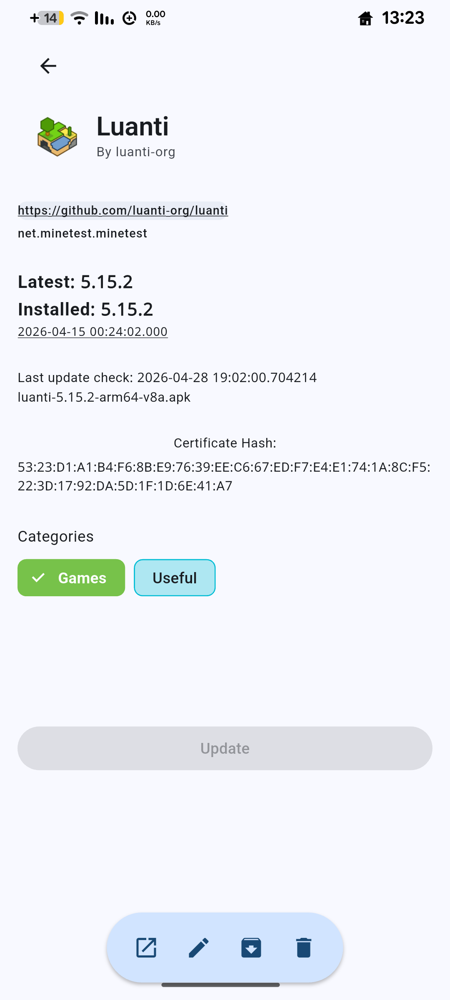

#  Updatium

Update your Android apps directly from the APK source. Updatium is a customizable Android app catalogue that allows you to update your apps directly from their APK sources, and to receive notifications when updates are available.

#### [Testers needed. Click here for more information.](https://github.com/omeritzics/Updatium/issues/280)

## Features
### Currently supported App sources:
| Open Source (General) | Other (General) | Other (App-specific) |
| :--- | :--- | :--- |
|  [GitHub](https://github.com/) |  [APKPure](https://apkpure.net/) |  [Neutron Code](https://neutroncode.com/) |
|  [GitLab](https://gitlab.com/) |  [Aptoide](https://aptoide.com/) | 🏗️ Jenkins Jobs |
|  [Forgejo](https://forgejo.org/) ([Codeberg](https://codeberg.org/)) |  [Uptodown](https://uptodown.com/) | 📦 Direct APK Link |
|  [F-Droid](https://f-droid.org/) |  [Huawei AppGallery](https://appgallery.huawei.com/) | 🌐 HTML page fallback |
| 🧩 Third Party F-Droid Repos |  [Tencent App Store](https://sj.qq.com/) | |
|  [IzzyOnDroid](https://android.izzysoft.de/) |  [vivo App Store (CN)](https://h5.appstore.vivo.com.cn/) | |
|  [SourceHut](https://git.sr.ht/) |  [RuStore](https://rustore.ru/) |  | |
| |  [APKCombo](https://apkcombo.com/) | |
| |  [APKMirror](https://apkmirror.com/) | |

### Improved Design
Based on Material Design 3 Expressive guidelines.

### Other Additional Features
- Hide non-installed apps.
- Better accessability for screen readers.
- Grid View.

### Localization
Updatium currently supports 38 locales (including English). If you want to help translate Updatium to your language or improve an existing translation, please open a pull with the new translations added to [here](https://github.com/omeritzics/Updatium/tree/main/assets/translations).

If you don't know how to make a pull request, and/or you don't have any experience with Git, you can open an issue [here](https://github.com/omeritzics/Updatium/issues/new/choose) and I'd be happy to help you with adding your language. 

Every language is welcome to Updatium, but your help is needed to make it happen.

* Currently supported locales: English, 简体中文, 臺灣話, Italiano, 日本語, עברית, हिन्दी, Magyar, Deutsch, فارسی, Français, Español, Polski, Русский, Bosanski, Português, Česky, Svenska, Nederlands, Tiếng Việt, Türkçe, Українська, Dansk, Eesti, Esperanto, Bahasa Indonesia, বাংলা, 한국어, Català, العربية, മലയാളം, Galego, Български, Kurdî (Kurmanjî), Bahasa Melayu, Română, ئۇيغۇرچە.

## Download

Do not download Updatium from unofficial sources (such as Appteka), since these may contain more bugs, or even malware.

## Screenshots

|  |            |     |
| ------------------------------------------------------ | ----------------------------------------------------------------------- | -------------------------------------------------------------------- |
|    | |  |

## Limitations
- For some sources, data is gathered using Web scraping and can easily break due to changes in website design. In such cases, more reliable methods may be unavailable.

## Frequently Asked Questions
### Q: What is Updatium?
A: Updatium started as a fork of [Obtainium](https://github.com/ImranR98/Obtainium), aiming to be a better alternative to it. Updatium is a customizable app catalogue, to which you can add almost any application you want from a variety of sources, like GitHub and APKPure.

### Q: Why fork Obtainium?
A: One word - antisemitism. While Obtainium is a really powerful tool, its developer intended to block people from a specific nation from getting involved into the project. Updatium aims not just to be an update to Obtainium, but also to provide a broad, accepting, welcoming open source community.

### Q: Does Updatium encourage piracy?
A: Absolutely not! Updatium is highly against piracy and modded applications.

### Q: How can I help?
A: There are many ways you can. Simply open an issue on the project's GitHub and introduce yourself. Your contribution doesn't have to be code - it could also be bug reporting, translating the app into new languages (or improving existing translations), design proposals and ideas. Starring Updatium and sharing it to people who you think may like it can also help Updatium grow. Thank you for your support :)
