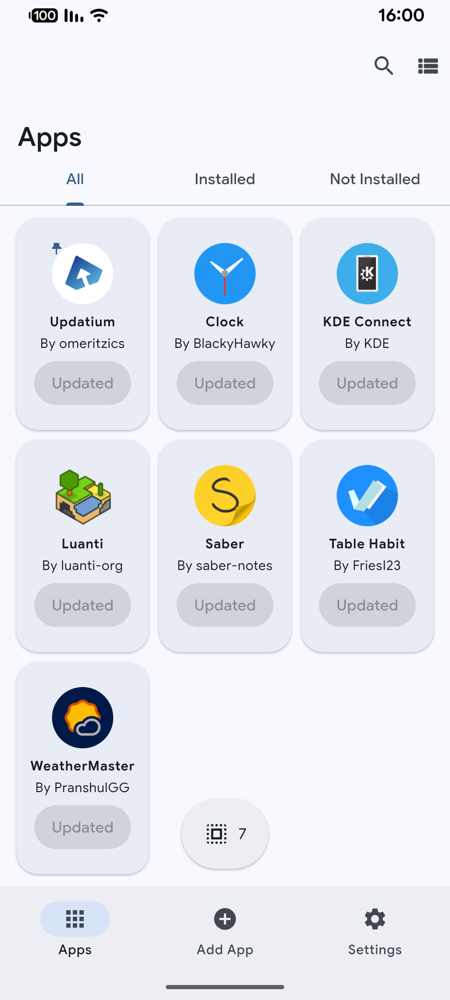
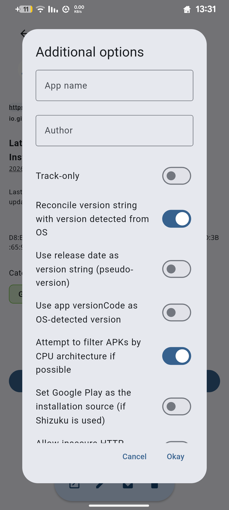
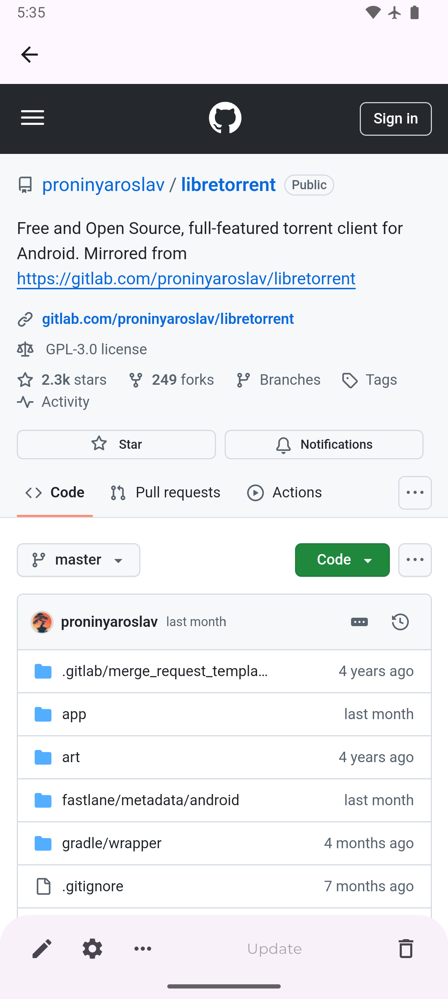

#  Updatium

Update your Android apps directly from the APK source. Updatium is a customizable Android app catalogue that allows you to update your apps directly from their APK sources, and to receive notifications when updates are available.

## Features

### Currently supported App sources

| Open Source (General) | Other (General) | Other (App-specific) |
| :------------------- | :-------------- | :------------------ |
|  [GitHub](https://github.com/) |  [APKPure](https://apkpure.net/) |  [Neutron Code](https://neutroncode.com/) |
|  [GitLab](https://gitlab.com/) |  [Aptoide](https://aptoide.com/) | 🏗️ Jenkins Jobs |
|  [Forgejo](https://forgejo.org/) ([Codeberg](https://codeberg.org/)) |  [Uptodown](https://uptodown.com/) | 📦 Direct APK Link |
|  [F-Droid](https://f-droid.org/) |  [Huawei AppGallery](https://appgallery.huawei.com/) | 🌐 HTML page fallback |
| 🧩 Third Party F-Droid Repos |  [Tencent App Store](https://sj.qq.com/) |  [WhatsApp](https://whatsapp.com/) |
|  [IzzyOnDroid](https://android.izzysoft.de/) |  [vivo App Store (CN)](https://h5.appstore.vivo.com.cn/) |  [Signal (Nightly builds only)](https://signal.org/) |
|  [SourceHut](https://git.sr.ht/) |  [RuStore](https://rustore.ru/) |  [VLC (Nightly builds only)](https://www.videolan.org/) |
|  [OpenAPK (Nightly builds only)](https://www.openapk.net/) |  [APKCombo](https://apkcombo.com/) | |
|  [Bitbucket (Nightly builds only)](https://www.bitbucket.org) |  [APKMirror](https://apkmirror.com/) | |
|  [Gitea (Nightly builds only)](https://try.gitea.io/) | | |

### Improved Design

Based on Material Design 3 Expressive guidelines.

### Other Additional Features

- Better accessibility for screen readers.
- Grid View.
- Safe Mode (allows you to block unwanted changes to the application catalogue).
- Ability to use DNS-over-HTTPS providers (Nightly builds only).
- Editing basic app information after adding it (Nightly builds only).

### Localization

Updatium currently supports ~42~ 40 locales (including English). If you want to help translate Updatium to your language or improve an existing translation, please open a pull request with new translations added in the [translations directory](https://github.com/omeritzics/Updatium/tree/main/assets/translations).

If you don't know how to make a pull request, and/or you don't have any experience with Git, you can open an issue  and I'd be happy to help you with adding your language.

Every language is welcome to Updatium, but your help is needed to make it happen.

- Currently supported locales: English, 简体中文, Italiano, 日本語, עברית, हिन्दी, Magyar, Deutsch, فارسی, Français, Español, Polski,
Русский, Bosanski, Português, Česky, Svenska, Nederlands, Tiếng Việt,
Türkçe, Українська, Dansk, Eesti, Esperanto, Bahasa Indonesia, বাংলা,
한국어, Català, العربية, മലയാളം, Galego, Български, Bahasa Melayu,
Română, ئۇيغۇرچە, Norsk (Bokmål), Ελληνικά, Filipino.

`Taiwanese Hokkien (臺灣話) and Northen Kurdish (Kurdî) are not supported yet due to technical limitations.`

## Download

Do not download Updatium from unofficial sources (such as Appteka), since these may contain more bugs, or even malware. If you are an administrator of an APK distribution source, please let me know you're interested in adding Updatium to your website by creating an issue.

## Screenshots

| |  |  |  |
|---|---|---|---|
|  |  |  | |

## Limitations

- For some sources, data is gathered using Web scraping and can easily break due to changes in website design. In such cases, more reliable methods may be unavailable.

## Troubleshooting

### App not updating even when a new version is available
- **Check the source settings** — Some sources require additional configuration (e.g., GitHub releases need the correct repository URL format)
- **Check if the source is supported** — Not all sources support version checking equally; some use HTML scraping which may be slower
- **Check the update interval** — By default, apps update every 6 hours. You can change this in app settings
- **Try force-refreshing** — Pull down on the apps list to force a refresh

### Source additions failing with 403 Forbidden
- Some sources block requests from unknown user agents or regions
- GitHub-based sources may need a Personal Access Token if you're hitting rate limits
- Some APK hosts (APKMirror, etc.) may require cookies or specific headers

### Flutter-related issues
- Obtainium is built with Flutter. If the app crashes on startup, try:
  - Clearing app data and reinstalling
  - Ensuring your Android version meets the minimum requirement
  - Checking if you have the latest Google Play Services

### APK verification failures
- If you see "Signature verification failed", ensure you haven't modified the APK after download
- The SHA-256 hash in the app settings should match the downloaded APK

## Screenshots

|  |            |     |
| ------------------------------------------------------ | ----------------------------------------------------------------------- | -------------------------------------------------------------------- |
|    |  |  |
